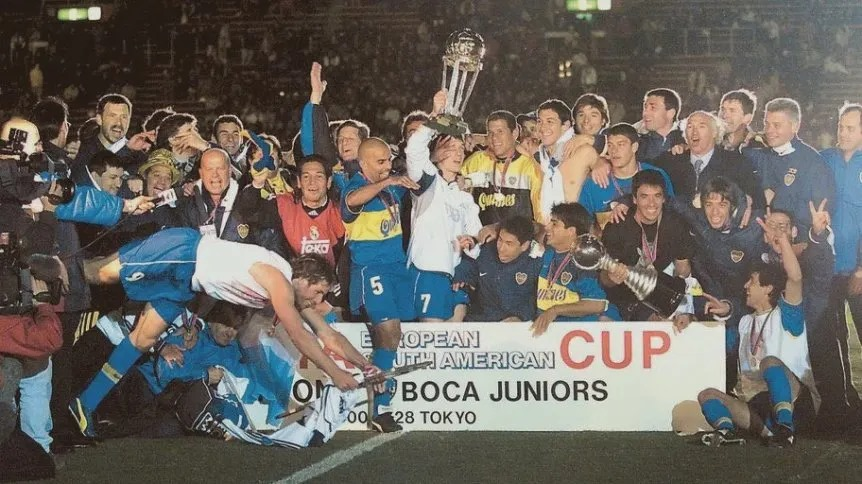

# Programación con objetos I
## Presentación Personal

### Datos Personales
Hola! Mi nombre es Cristian Ramirez, tengo 25 años y soy de Merlo-Libertad. Comencé a estudiar en el segundo cuatrimestre, osea este es mi cuarto cuatrimestre.

Habia comenzado en la tec. en Videojuegos pero opté por cambiarme a Programación. No me arrepiento para nada la verdad.

Me gusta mucho la carrera y este cuatrimestre arranque a hacer tutorias de Introducción a la lógica y Programación estructurada.

Mis dos hobbies son jugar jueguitos y mirar fútbol. Mi juego favorito es el skyrim, hasta lo llevo tatuado. Y soy hincha del mas grande Argentina, Boca Juniors

### Otra Información
- Ya conocía github y había hecho a principio de año un curso de git en la universidad.
- Tengo una caniche llamada Sky de un año.
- Viví un año en Córdoba.
- Boca el mas grande.
